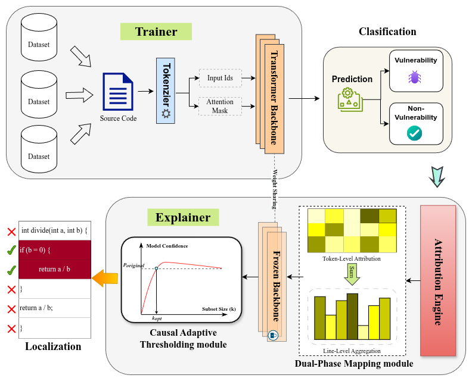

# From Explanation to Localization: A Causal XAI Framework for Understanding and Improving Transformer-Based Vulnerability Detection



## Overview

This repository contains the official implementation of the paper **"From Explanation to Localization: A Causal XAI Framework for Understanding and Improving Transformer-Based Vulnerability Detection"**.

**Vulnex** is a novel causal Explainable AI (XAI) framework designed to bridge the gap between model explanation and precise vulnerability localization in Transformer-based models. Unlike traditional approaches, Vulnex leverages causal inference to validate token-level signals, ensuring faithful and robust vulnerability detection.

> **Note:** The full source code, including dataset processing scripts and model training pipelines, will be made publicly available upon the acceptance of our paper.

## Abstract

Transformer-based models are widely used for software vulnerability detection, but their predictions are often difficult to explain and localize. This limits their usefulness in practical security analysis, where understanding why and where a vulnerability is detected is essential. This paper proposes **Vulnex**, a causal explainable artificial intelligence (XAI) framework for analyzing and localizing vulnerabilities in Transformer-based models. Vulnex converts token-level explanation signals into line-level vulnerability localization using aggregation strategies designed to reduce length bias. To avoid rigid Top-K selection, the framework introduces a causality inference–based adaptive thresholding mechanism that validates whether selected code lines are truly sufficient to support the model’s prediction. We further present a quantitative evaluation framework that jointly measures localization precision, recall, and overlap under different code length and context visibility settings. Experimental results across multiple models and datasets show that **Vulnex** provides more faithful and consistent vulnerability localization than existing XAI approaches, while revealing key limitations of current Transformer-based detectors.

## Dataset

We evaluate our framework on two widely used vulnerability detection datasets: **Devign** and **ReVeal**.

| Dataset | #Vul | #Non-Vul | Ratio (%) | Source |
| :--- | :---: | :---: | :---: | :--- |
| [Devign](https://sites.google.com/view/devign) | 12,181 | 14,555 | 45.6% | FFmpeg, QEMU |
| [Reveal](https://github.com/VulDetProject/ReVeal) | 2,240 | 20,494 | 9.8% | Linux, Chrome |

## Quick Start

### Requirements

- Python 3.8+
- PyTorch 1.12+
- Transformers (Hugging Face)

Install the necessary dependencies:

```bash
pip install -r requirements.txt
```

### Usage

To reproduce the explanation and localization results, run the following command:

```bash
# Example: Run Vulnex explanation on Devign dataset
python src/main.py --dataset devign --model codebert --strategy vulnex
```

To evaluate the localization performance:

```bash
python src/evaluate.py --results_dir outputs/ --metric all
```

## Requirements

*   Python 3.8+
*   PyTorch
*   Transformers (Hugging Face)
*   (See `requirements.txt` for full list)
